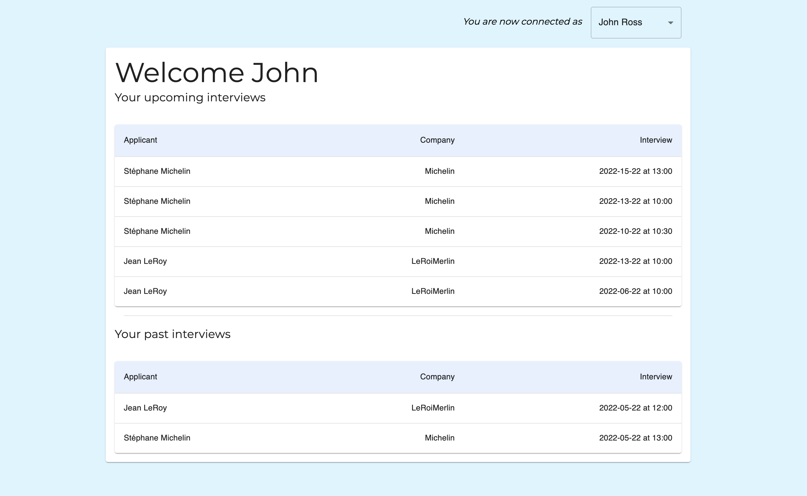
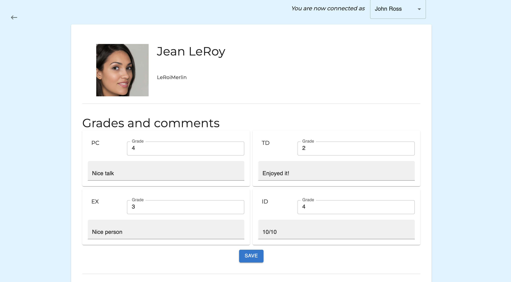
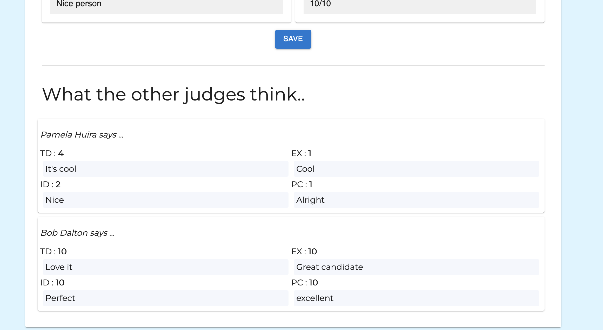
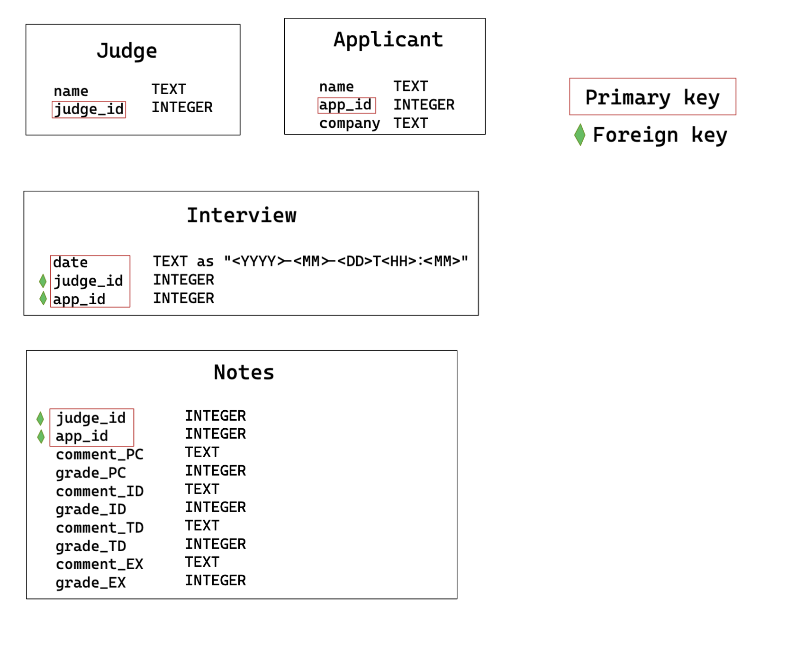

# HireMeX

Website created as part of a recruitment process created for an interview process.

## Project overview
StartX’s mission is to connect great founders together to help them solve their problems through collaboration.
To achieve this, we need to make sure that only the best founders are admitted: each session, applicants will go through a thorough admissions process, where expert judges will evaluate their impressiveness.

This website provides a platform where judges can exchange feedback through ratings and comments. It provides a clear interface to manage the interviews and their progress

### Front page
After identifying himself as a judge. Each judge has access to the list of interviews he has and will conduct. He/she gets the details for each of them. Each line of the table is a hyperlink to the profile page of the corresponding candidate.

### Profile page
There is a page for each candidate that summarizes their data as well as all the feedback that has been given.

The connected judge can read the feedback from other judges in a synthesized format that gives him a quick overview.
He can read the feedback he made previously and modify it.

_Footnote : The image chosen is not persistent because it is AI-generated. Visual anomaly may appear_

Watch media/full-demo.mov to see it in full or better, run it !
## Data Model and technology
Given the limited time available, the simplest technology was chosen, namely `sqlite3`.
The data is stored as follows

## How to run

The project was created using node v17.4.0, please ensure your version of node is recent enough. Start by cloning the repository. Start the api server before the client server.

### Database

Ensure you are using a recent enough version of `sqlite3` before proceeding :

- `cd database`
- `touch database.db` OR `cp database.example.db database.db` for a filled db 
- (only if you created an empty db) `sqlite3 database.db < initdb.sql` 

### Server

The server runs using `node.js`.

- `cd server`
- `npm install`
- `node index.js`

Server is now running on port 3000

### Client

The client app was created using `create-react-app`

- `cd client`
- `npm install`
- `npm start` to run in development mode (app will run on port 4000 on mac, on 3001 on PC)

## Potential future developments
Starting from the most important ones :
- a way to export reviews for applicant using a [pdf template](https://www.npmjs.com/package/pdf-creator-node)
- a real auth api (using jwt and an axios interceptor to automaticalluy refetch a token)
- an admin interface where one can create and edit applicants, judges, interviews..
- add a `photo_url` attribute in the `applicant` table (requires a CdN or equivalent)
- protect the DB from SQL injections by checking the inputs
- comment on each other's reviews
- open a websocket to see reviews in real time (with no reload necessity)
- [create ics events](https://www.npmjs.com/package/ics) on demand for the interviews